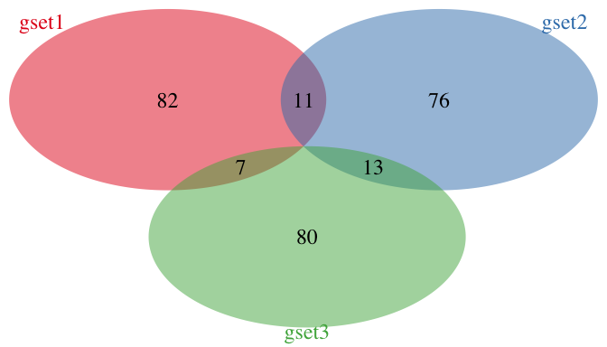
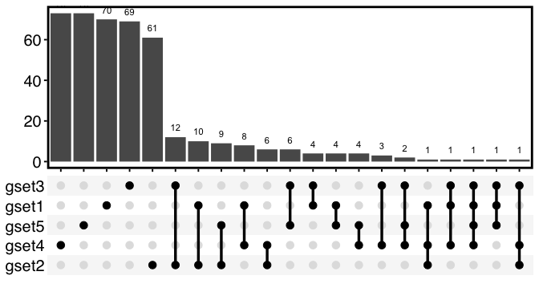
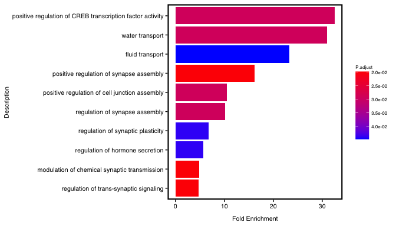
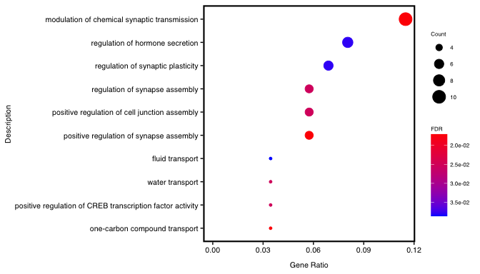
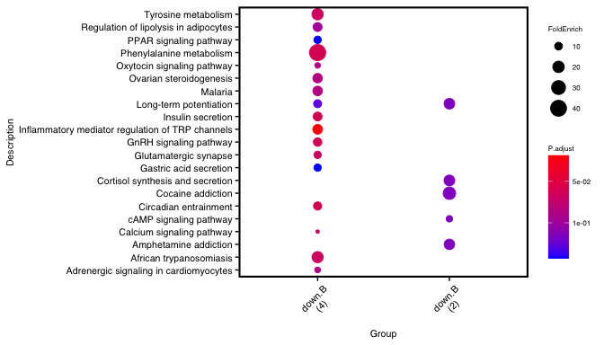
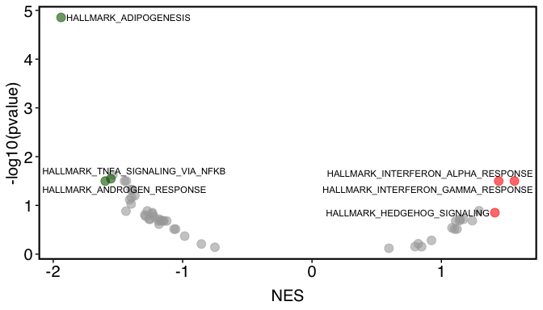
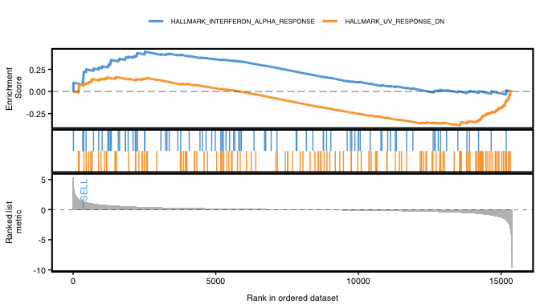

<!-- README.md is generated from README.Rmd. Please edit Rmd file -->

# genekitr

**genekitr** is an R analysis toolkit based on the gene. It mainly
contains five features:

-   Search: Gene IDs as input then get gene-related information (exp.
    location, gene name, gene alias, GC content …) as well as search
    gene-related PubMed records

-   Transform: Transform gene ID type among “symbol”, “entrezid”,
    “ensembl” and “uniprot”

-   Analysis: Gene enrichment analysis including ORA (GO and KEGG) and
    GSEA

-   Visualize: Visualization for enrichment analysis and gene overlaps

-   Export: Gene IDs and analysis results could be exported as various
    sheets in one Excel file, which could be easily read and shared with
    others

**Why develop this R package?**

Features：

-   Many gene alias could not be recognized. For example, BCC7(human) is
    actually TP53; Tp53(mouse) is actually Trp53, Trp53inp2 & Ano9. Many
    popular gene symbol like PD1/PDL1 has own gene ID PDCD1/CD274, which
    could be omitted in downstream analysis.

-   Some popular gene ID transforming package only support dozens of
    model species. But here we support 190 species

-   Some R package sets many arguments as input, but we only use
    simplest argument. For example, user only need to input gene ID then
    the function will determine gene type automatically.

-   Keep updating annotating resource with online database (Ensembl &
    Uniprot). For now, we use the current Ensemble v104.

-   Some package exports result as an object which not frendly for users
    to export and share with others. We export the analysis results as
    dataframes which could easily share and plot.

-   Built in plotting functions could produce pre-published figures then
    users only need to simply modify using AI.

## Table of Contents

-   [Installation](#installation)
-   [Quick guide](#quick-guide)
-   [Vignette](#vignette)
-   [Citation](#citation)
-   [Welcome to contribute](#welcome-to-contribute)

## Installation

Install CRAN stable version:

``` r
install.packages("genekitr")
```

Install GitHub dev version:

``` r
# install.packages("remotes")
remotes::install_github("GangLiLab/genekitr")
# To build local vignette:
# remotes::install_github("GangLiLab/genekitr", build_vignettes = TRUE, dependencies = TRUE)
```

## Quick guide

To quickly go through the package usage, we will use built-in gene list
from GEO airway

([GSE52778](https://www.ncbi.nlm.nih.gov/geo/query/acc.cgi?acc=GSE52778))
DEG analysis.

### Search

##### Search gene related information

`org` argument could accept fullname or shortname of specific organism.
For example, we could

use common name: `human/hs/hg/hsa` to describe human.

``` r
library(genekitr)
#> 
library(dplyr)
#> 
#> Attaching package: 'dplyr'
#> The following objects are masked from 'package:stats':
#> 
#>     filter, lag
#> The following objects are masked from 'package:base':
#> 
#>     intersect, setdiff, setequal, union
data(geneList)
id = names(geneList)[1:100]
head(id)
#> [1] "2847"   "148145" "1591"   "2903"   "26045"  "10268"
ginfo = genInfo(id, org = 'human')
dplyr::as_tibble(head(ginfo))
#> # A tibble: 6 × 21
#>   input_id symbol    ensembl  uniprot   chr   start end   width strand gene_name
#>   <ord>    <chr>     <chr>    <chr>     <chr> <chr> <chr> <chr> <chr>  <chr>    
#> 1 2847     MCHR1     ENSG000… Q99705; … 22    4067… 4068… 4065  1      melanin …
#> 2 148145   LINC00906 ENSG000… <NA>      19    2888… 2897… 87445 1      long int…
#> 3 1591     CYP24A1   ENSG000… Q07973    20    5415… 5417… 20541 -1     cytochro…
#> 4 2903     GRIN2A    ENSG000… Q12879; … 16    9753… 1018… 4295… -1     glutamat…
#> 5 26045    LRRTM2    ENSG000… O43300; … 5     1388… 1388… 6448  -1     leucine …
#> 6 10268    RAMP3     ENSG000… O60896; … 7     4515… 4518… 28512 1      receptor…
#> # … with 11 more variables: ncbi_alias <chr>, ensembl_alias <chr>,
#> #   gc_content <chr>, gene_biotype <chr>, transcript_count <chr>,
#> #   hgnc_id <chr>, omim <chr>, ccds <chr>, reactome <chr>, ucsc <chr>,
#> #   mirbase_id <chr>
```

##### Get specific type genes

For example, we want to retrieve all human protein-coding ids. Just
leave argument `id` empty.

``` r
pro_hg = genInfo(org = 'human') %>% 
  dplyr::filter(gene_biotype  == 'protein_coding') %>% dplyr::pull(symbol)
head(pro_hg) 
#> [1] "A1BG"    "NAT2"    "ADA"     "CDH2"    "AKT3"    "GAGE12F"
# number of human protein id
length(pro_hg)
#> [1] 19398
```

##### Search gene PubMed records

``` r
pub = genPubmed(
  id = c("Cyp2c23", "Fhit", "Gal3st2b","Insl3", "Gbp4"),
  keywords = "stem cell", field = "tiab")
#> Search example: Cyp2c23 [TIAB] AND stem cell [TIAB]
dplyr::as_tibble(head(pub))
#> # A tibble: 6 × 6
#>   gene    title                      date    doi            pmid  journal       
#>   <chr>   <chr>                      <chr>   <chr>          <chr> <chr>         
#> 1 Cyp2c23 NA                         NA      "NA"           NA    NA            
#> 2 Fhit    Changes in Methylation Pa… 2021_0… "10.1155/2021… 3455… Stem cells in…
#> 3 Fhit    Methylation status of the… 2020_1… "10.3892/ol.2… 2613… Oncology lett…
#> 4 Fhit    Totipotent stem cells bea… 2009_0… "10.1111/j.13… 1901… British journ…
#> 5 Fhit    Fhit-deficient hematopoie… 2008_0… "10.1158/0008… 1848… Cancer resear…
#> 6 Fhit    Induction by 7,12-dimethy… 2006_1… ""             1686… International…
```

### Transform

Regardless of input ID type, function will detect automatically.

User only need to specify which type you want, the left things just give
`transId`.

##### Transform ID from entrezid to symbol

``` r
id[1:5]
#> [1] "2847"   "148145" "1591"   "2903"   "26045"
transId(id[1:5], trans_to = 'symbol',org='hs')
#> 
#> 100% genes are mapped from entrezid to symbol
#> [1] "MCHR1"     "LINC00906" "CYP24A1"   "GRIN2A"    "LRRTM2"
```

##### Transform gene alias

``` r
transId(c('BCC7','PDL1','PD1'), trans_to = 'symbol',org='human')
#> 
#> 100% genes are mapped from symbol to symbol
#> [1] "TP53"  "CD274" "PDCD1"

# We could get all matched id when one-to-many occurs
transId(c('BCC7','PDL1','PD1'), trans_to = 'symbol',org='hg',unique = F)
#> Some ID occurs one-to-many match, like "PD1"
#> If you want to get one-to-one match, please set "unique=TRUE"
#> 
#> 100% genes are mapped from symbol to symbol
#>   input_id symbol
#> 1     BCC7   TP53
#> 2     PDL1  CD274
#> 3      PD1  PDCD1
#> 4      PD1   SNCA
#> 5      PD1 SPATA2
```

##### Transform protein id to gene id

``` r
# to symbol
transId(c('Q12879','Q86V25','Q8N386','Q5T7N3'),'sym','hs')
#> 
#> 100% genes are mapped from uniprot to symbol
#> [1] "GRIN2A" "VASH2"  "LRRC25" "KANK4"
# to ensembl
transId(c('Q12879','Q86V25','Q8N386','Q5T7N3'),'ens','hs')
#> 
#> 100% genes are mapped from uniprot to ensembl
#> [1] "ENSG00000183454" "ENSG00000143494" "ENSG00000175489" "ENSG00000132854"
```

##### Transform ensembl id to symbol

``` r
transId(c('ENSG00000146006','ENSG00000134321','ENSG00000136267','ENSG00000105989'),'sym','hg')
#> 
#> 100% genes are mapped from ensembl to symbol
#> [1] "LRRTM2" "RSAD2"  "DGKB"   "WNT2"
```

##### Transform ensembl id to protein id

``` r
transId(c('ENSG00000146006','ENSG00000134321','ENSG00000136267','ENSG00000105989'),'uniprot','hg')
#> 
#> 100% genes are mapped from ensembl to uniprot
#> [1] "O43300; E5RIQ2; E5RHE5"                            
#> [2] "Q8WXG1; C9J674; A0A7P0TA11; A0A7P0Z4E2; A0A7P0T918"
#> [3] "Q9Y6T7; B7ZL83; B5MCD5; B5MBY2; C9JA18"            
#> [4] "P09544; A0A3B3ITC9; C9JUI2; F8WDR1; L8EA39"
```

### Analysis

All enrichment analysis \*\* just give a gene list \*\* (especially GSEA
need the gene list with a decreasing fold change)

#### over representation analysis (ORA)

##### GO analysis

User could choose ontology among “bp”, “cc”, “mf” or “all”.

If set `use_symbol = TRUE`, the result will return gene symbol for easy
understanding.

If you are not sure the organism name, please type `biocOrg_name` and
choose full name or short name

``` r
ego_bp = genGO(id[1:100], org = 'human', ont = 'bp',pvalueCutoff = 0.05,qvalueCutoff = 0.05, use_symbol = T)

# user could choose all three ontology
ego_all = genGO(id[1:100], org = 'human', ont = 'all',pvalueCutoff = 0.05,qvalueCutoff = 0.05, use_symbol = T)
```

##### KEGG analysis

If you are not sure the organism name, please type `keggOrg_name` and
choose full name or short name

``` r
ekeg = genKEGG(id, org = 'hg',use_symbol = T)

# If we want to compare different groups of genes, we only need to add a gene group list
group = list(groupA = c(rep("up",50),rep("down",50)),
             groupB = c(rep("A",30), rep("B",70)))
ekeg_compare =  genKEGG(c(head(id,50),tail(id,50)), group_list = group,
                    org = 'human',pvalueCutoff = 0.15,qvalueCutoff = 0.15, use_symbol = T)
```

#### gene set enrichment analysis (GSEA) analysis

`category` argument could choose from ‘C1’,‘C2’,‘C3’,
‘C4’,‘C5’,‘C6’,‘C7’,‘C8’ and ‘H’

If you are not sure `subcategory`, you can only choose `category` and
leave `subcategory` as blank.

The message will tell what options you could choose in the main
`category`.

``` r
egsea = genGSEA(genelist = geneList,org = 'hs', 
                category = "H",
                use_symbol = T, pvalueCutoff = 1)
#> H has no subcategory, continue...
```

### Visulaize

##### Gene overlap

If we only have two or three groups of genes, the function will plot
Venn diagram;

If we have at least four groups of genes, the default option will be
UpSet diagram.

``` r
# if only have three groups
set1 <- paste0(rep("gene", 100), sample(c(1:1000), 100))
set2 <- paste0(rep("gene", 100), sample(c(1:1000), 100))
set3 <- paste0(rep("gene", 100), sample(c(1:1000), 100))
sm_gene_list <- list(gset1 = set1, gset2 = set2, gset3 = set3)
plotVenn(sm_gene_list,
  text_size = 1.5, alpha_degree = 1,
  remove_grid = TRUE)
#> Color length should be same with venn_list, auto assign colors...
```

<!-- -->

``` r
# if only have five groups
set4 <- paste0(rep("gene", 100), sample(c(1:1000), 100))
set5 <- paste0(rep("gene", 100), sample(c(1:1000), 100))
la_gene_list <- list(gset1 = set1, gset2 = set2, gset3 = set3,
  gset4 = set4, gset5 = set5)
plotVenn(la_gene_list,
  text_size = 15, alpha_degree = 0.2, border_thick = 2,
  remove_grid = TRUE, use_venn = FALSE)
```

<!-- -->

##### Enrichment plot

-   Support barplot, dotplot

-   x-axis support: GeneRatio/Count/FoldEnrich

-   stats support: pvalue/p.adjust/qvalue(FDR)

-   easily modify plot line & text pattern

``` r
plotEnrich(ego_bp,plot_type = 'bar',remove_grid = T, main_text_size = 8,
  legend_text_size = 6,border_thick = 1.5)
```

<!-- -->

``` r
plotEnrich(ego_all,plot_type = 'bar', xlab_type = 'GeneRatio',legend_type = 'qvalue',
           remove_grid = T, main_text_size = 8, legend_text_size = 6,border_thick = 1.5)
```

<!-- -->

##### Enrichment dotplot

``` r
plotEnrich(ego_bp,plot_type = 'dot',xlab_type = 'GeneRatio',legend_type = 'qvalue',
          remove_grid = T, main_text_size = 8, legend_text_size = 6)
```

<!-- -->

``` r
plotEnrich(ekeg_compare)
```

<!-- -->

##### gsea plot

-   support: volcano/classic/multi-pathway(fgsea)

``` r
plotGSEA(egsea,plot_type = 'volcano', show_pathway = 3)
```

<!-- -->

``` r
plotGSEA(egsea, plot_type = 'classic', show_pathway = c("HALLMARK_UV_RESPONSE_DN","HALLMARK_INTERFERON_ALPHA_RESPONSE"),
         show_genes = c("SELL"))
```

<!-- -->

``` r
# default shows top3 up & down pathways
plotGSEA(egsea, plot_type = 'fgsea')
```

<!-- -->

### Export

If you want to export many data sets in one file, you could use
`expoSheet`

For example, since we got 100 genes’ GO and KEGG result, then we want to
export them with gene information:

``` r
expoSheet(
  dat_list = list(ginfo, ego_bp, ego_all,ekeg), name_list = list("GeneInfo","GO-BP", "GO-All","KEGG"),
  filename = "gene_enrich.xlsx", dir = tempdir())
```

The result will be:


## Vignette

### English

-   Wait to update…

### 中文区 (推文专区)

-   wait to update…

## Citation

Wait for paper …

## Welcome to contribute

If you are interested in this tool, welcome contribute your ideas as
follows:

-   Git clone this project
-   Double click `genekitr.Rproj` to open RStudio
-   Modify source code in `R/` folder
-   Run `devtools::check()` to make sure no errors, warnings or notes
-   Pull request and describe clearly your changes
